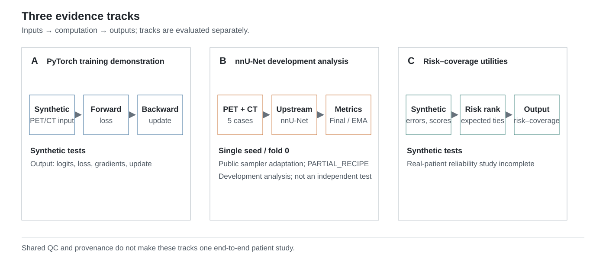

# PET/CT Segmentation, Quantification, and Reliability Engineering

[](https://github.com/ddd08-right/PET-AI-Engineering/actions/workflows/ci.yml)

This repository asks a focused engineering question: **can segmentation overlap
and net volume error give different rankings to the same predictions?** It
connects public-safe PET/CT segmentation software to physical quantification,
selective-review methods, and explicit evidence boundaries. It is not a
clinical validation study.

Overlap and net volume error answer different questions. Dice measures spatial
agreement, whereas net volume error compares total predicted and reference
volume. False-positive and false-negative volume can cancel in the latter even
when the predicted foreground is poorly located. The repository therefore
treats metric choice, applicability counts, physical units, and empty-reference
behavior as part of the engineering contract rather than presentation details.



*Figure 1. Inputs, computation, and outputs for three separate tracks. The
PyTorch training demonstration and risk–coverage utilities use synthetic tests;
the nnU-Net analysis uses five development-validation cases from one seed and
fold. These tracks are not a completed patient-level pipeline. [PNG
preview](docs/figures/evidence_overview.png).*

The tracks serve different purposes: the PyTorch path makes the mechanics of a
training update inspectable, the development case preserves a bounded real-run
observation, and the reliability path tests ranking mathematics. Shared QC and
provenance utilities connect the software, but do not merge these evidence
levels or convert synthetic checks into patient evidence.

## Implementation highlights

| Capability | Implementation | Behavioral check | Evidence scope |
| --- | --- | --- | --- |
| PyTorch training demonstration: forward, BCE/soft-Dice loss, backward gradients, and optimizer update | [`unet3d.py`](src/pet_ai/models/unet3d.py), [`segmentation.py`](src/pet_ai/losses/segmentation.py), [`engine.py`](src/pet_ai/training/engine.py) | [`test_unet3d.py`](tests/test_unet3d.py), [`test_pytorch_loss.py`](tests/test_pytorch_loss.py), [`test_pytorch_training.py`](tests/test_pytorch_training.py) | Synthetic tests; the compact U-Net pattern and PyTorch are not claimed as original research. |
| PET/CT geometry QC and affine-determinant mask volume | [`geometry.py`](src/pet_ai/qc/geometry.py), [`volume.py`](src/pet_ai/quantification/volume.py) | [`test_geometry.py`](tests/test_geometry.py), [`test_quantification.py`](tests/test_quantification.py) | Synthetic NIfTI and NumPy checks; same-grid status does not prove anatomical registration. |
| Binary segmentation and physical error quantities | [`segmentation.py`](src/pet_ai/evaluation/segmentation.py), [`volume.py`](src/pet_ai/quantification/volume.py) | [`test_segmentation_metrics.py`](tests/test_segmentation_metrics.py), [`test_quantification.py`](tests/test_quantification.py) | TP/FP/FN, Dice, FPV/FNV and generic mask volume under explicit empty-reference and unit policies. |
| Risk–coverage curves, AURC, and order-invariant expected handling of score ties | [`risk_coverage.py`](src/pet_ai/reliability/risk_coverage.py) | [`test_risk_coverage.py`](tests/test_risk_coverage.py) | Synthetic arrays only; no completed patient-level reliability study. |

## Development case

The traceable case is a post-hoc, development-exposed comparison from one
40-epoch run: seed `20260924`, fold `0`, and five development-validation cases.
The EMA-selected checkpoint, chosen by upstream online EMA pseudo Dice, had
higher Mean Dice, non-empty references, than the final checkpoint (`0.2187`
versus `0.0991`, each over `n=3`), while the final checkpoint had lower Volume MAE
(`59.43 mL` versus `63.21 mL`, each over `n=5`). Thus overlap and net-volume
endpoints ranked the checkpoints differently. The Empty-mask control (analytic)
had Volume MAE `33.30 mL` (`n=5`) but Mean Dice `0.0000` (`n=3`); it is not model
inference, and its lower error does not indicate usable foreground
segmentation. These observations do not isolate a causal effect of training
duration.

Only public-safe aggregates and applicability counts are available here. The
protected predictions and per-case values needed to recompute those aggregates
are not published, so the comparison is traceable but not independently
reproducible from this repository alone.

See the [case report](docs/DEVELOPMENT_BASELINE_40E_CASE.md),
[metric figure](docs/figures/development_metric_tradeoff.svg),
[partial method recipe](configs/development_baseline_40e/README.md), and
[frozen aggregate record](docs/development_baseline_40e_summary.json).

## Quick start

Python 3.10 or newer is required. Install the core package and test tools, then
run the CPU synthetic pipeline:

```powershell
python -m pip install -e ".[test]"
python scripts/demo_pipeline.py
```

The demo creates temporary synthetic PET, CT, reference-mask, prediction-mask,
and manifest files; exercises manifest and split validation, geometry and label
QC, voxel and lesion metrics, and provenance; then removes the temporary image
files. Its output is engineering status for synthetic fixtures, not patient
performance. The optional [PyTorch training demonstration](scripts/demo_pytorch_train.py)
requires the separately declared `pytorch` extra. The nnU-Net development
method is a [`PARTIAL_RECIPE`](configs/development_baseline_40e/README.md), not
an independent one-command reproduction of the historical run.

## Scope and further reading

Public executable tests and demos use synthetic data. The only real-prediction
evidence published here is the de-identified aggregate record for five
development-validation cases from a single seed and fold; validation results
were repeatedly inspected during engineering. There is no independent test or
external validation, and a real-patient reliability study is incomplete. The
public method omits protected data, weights, split membership, private
orchestration, and parts of the historical recovery context, so it cannot
independently reproduce the private result. Recorded hashes support provenance,
not clinical validity. AutoPET, nnU-Net, Blackbean, and TCIA_processing remain
upstream or third-party work.

Further reading: [architecture](docs/ARCHITECTURE.md),
[implementation-to-test evidence](docs/PROGRAMMING_EVIDENCE.md),
[development case](docs/DEVELOPMENT_BASELINE_40E_CASE.md),
[partial recipe](configs/development_baseline_40e/README.md),
[data provenance](docs/DATA_PROVENANCE.md), and
[third-party attribution](THIRD_PARTY.md).

Candidate future study design: [PROPOSED / NOT RUN](docs/RESEARCH_DESIGN_CANDIDATE.md).
